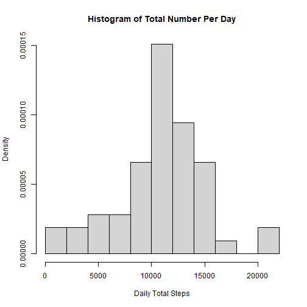
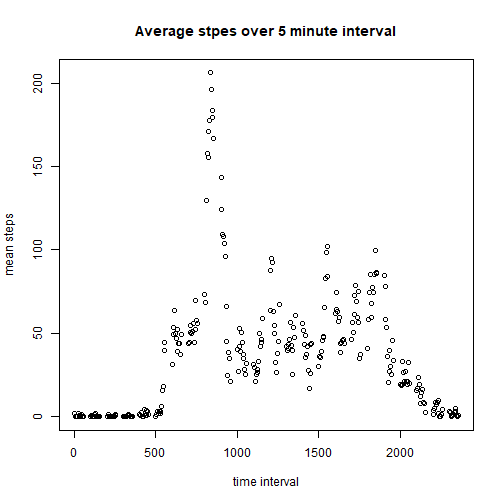
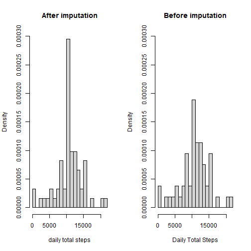
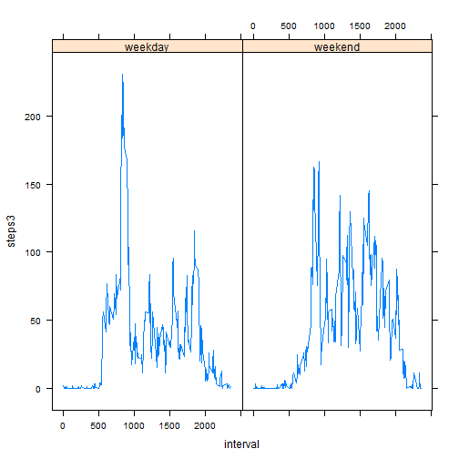

## Loading and preprocessing the data

Reading data into R and create DF dt with summary


```r
dt<-read.csv("C:/coursera/Reproducible-research/activity.csv")
head(dt)
```

```
##   steps       date interval
## 1    NA 2012-10-01        0
## 2    NA 2012-10-01        5
## 3    NA 2012-10-01       10
## 4    NA 2012-10-01       15
## 5    NA 2012-10-01       20
## 6    NA 2012-10-01       25
```

```r
summary(dt)
```

```
##      steps            date              interval     
##  Min.   :  0.00   Length:17568       Min.   :   0.0  
##  1st Qu.:  0.00   Class :character   1st Qu.: 588.8  
##  Median :  0.00   Mode  :character   Median :1177.5  
##  Mean   : 37.38                      Mean   :1177.5  
##  3rd Qu.: 12.00                      3rd Qu.:1766.2  
##  Max.   :806.00                      Max.   :2355.0  
##  NA's   :2304
```

## What is mean total number of steps taken per day?
Using aggregate() to calculate total number per day and its mean and median  
For this part ignore the missing value


```r
totalno<-aggregate(steps~date, sum, data=dt)
print (totalno)
```

```
##          date steps
## 1  2012-10-02   126
## 2  2012-10-03 11352
## 3  2012-10-04 12116
## 4  2012-10-05 13294
## 5  2012-10-06 15420
## 6  2012-10-07 11015
## 7  2012-10-09 12811
## 8  2012-10-10  9900
## 9  2012-10-11 10304
## 10 2012-10-12 17382
## 11 2012-10-13 12426
## 12 2012-10-14 15098
## 13 2012-10-15 10139
## 14 2012-10-16 15084
## 15 2012-10-17 13452
## 16 2012-10-18 10056
## 17 2012-10-19 11829
## 18 2012-10-20 10395
## 19 2012-10-21  8821
## 20 2012-10-22 13460
## 21 2012-10-23  8918
## 22 2012-10-24  8355
## 23 2012-10-25  2492
## 24 2012-10-26  6778
## 25 2012-10-27 10119
## 26 2012-10-28 11458
## 27 2012-10-29  5018
## 28 2012-10-30  9819
## 29 2012-10-31 15414
## 30 2012-11-02 10600
## 31 2012-11-03 10571
## 32 2012-11-05 10439
## 33 2012-11-06  8334
## 34 2012-11-07 12883
## 35 2012-11-08  3219
## 36 2012-11-11 12608
## 37 2012-11-12 10765
## 38 2012-11-13  7336
## 39 2012-11-15    41
## 40 2012-11-16  5441
## 41 2012-11-17 14339
## 42 2012-11-18 15110
## 43 2012-11-19  8841
## 44 2012-11-20  4472
## 45 2012-11-21 12787
## 46 2012-11-22 20427
## 47 2012-11-23 21194
## 48 2012-11-24 14478
## 49 2012-11-25 11834
## 50 2012-11-26 11162
## 51 2012-11-27 13646
## 52 2012-11-28 10183
## 53 2012-11-29  7047
```

```r
mean(totalno$steps)
```

```
## [1] 10766.19
```

```r
median(totalno$steps)
```

```
## [1] 10765
```
The mean total number steps per day = 10766.19 and the median=10765.

##### Histogram of total number of steps per day


```r
hist(totalno$steps, freq=FALSE, breaks=10, xlab="Daily Total Steps", main="Histogram of Total Number Per Day")
```




## What is the average daily activity pattern?

time series plot of 5 minute interval and average number of steps taken across all days.


```r
intervalmean<-aggregate(steps~interval, mean, data=dt)
plot(intervalmean$interval, intervalmean$steps, xlab="time interval", ylab="mean steps", main="Average stpes over 5 minute interval")
```



```r
intervalmean$interval[which.max(intervalmean$steps)]
```

```
## [1] 835
```

```r
max(intervalmean$steps)
```

```
## [1] 206.1698
```

The interval with maximum mean value = 835 and the max mean value=206.1698

## Imputing missing values

I use the interval mean as the imputed value for missings in the corresponding intervals.


```r
sum(is.na(dt$steps))
```

```
## [1] 2304
```

```r
intervalmean=aggregate(steps~interval, mean, data=dt)
names(intervalmean)<-c("interval","stepsmean")
dt2<-merge(dt, intervalmean, by="interval")
dt2$steps3<-dt2$steps
dt2$steps3[is.na(dt2$steps)]<-dt2$stepsmean[is.na(dt2$steps)]
```
There are 2304 missing values.
Now we look at the distribution of before and after imputation


```r
summary(dt2[,c("steps","steps3")])
```

```
##      steps            steps3      
##  Min.   :  0.00   Min.   :  0.00  
##  1st Qu.:  0.00   1st Qu.:  0.00  
##  Median :  0.00   Median :  0.00  
##  Mean   : 37.38   Mean   : 37.38  
##  3rd Qu.: 12.00   3rd Qu.: 27.00  
##  Max.   :806.00   Max.   :806.00  
##  NA's   :2304
```

```r
dailytot <- aggregate(steps3 ~ date, sum, data=dt2)

def.par <- par(no.readonly = TRUE)
layout(matrix(c(1,2), 1, 2, byrow = TRUE))

hist(dailytot$steps3, freq=FALSE, breaks=20, ylim=c(0, 0.0003), xlab="daily total steps", main="After imputation")
hist(totalno$steps, freq=FALSE, breaks=20, ylim=c(0, 0.0003), xlab="Daily Total Steps", main="Before imputation")
```



```r
par(def.par)

mean(dailytot$steps3)
```

```
## [1] 10766.19
```

```r
median(dailytot$steps3)
```

```
## [1] 10766.19
```
After imputation, the mean and median number of daily steps both = 10766.19  
Before imputation, the mean and median = 10766.19 and 10765, respectively.  
The mean and median do not change much before and after imputation. This is expected since  
we use the interval means as the imputed value for missing data. However, the two histograms  
different in the middle part.

## Are there differences in activity patterns between weekdays and weekends?
1. using as.Data() to convert character into date
2. using weekday() to create dummy for weekend (1=Yes, 0=No)

```r
dt2$date2<-as.Date(dt2$date,"%Y-%m-%d")
summary(dt2[,c("date", "date2")])
```

```
##      date               date2           
##  Length:17568       Min.   :2012-10-01  
##  Class :character   1st Qu.:2012-10-16  
##  Mode  :character   Median :2012-10-31  
##                     Mean   :2012-10-31  
##                     3rd Qu.:2012-11-15  
##                     Max.   :2012-11-30
```

```r
dt2$weekdays<-weekdays(dt2$date2)
dt2$weekend<-ifelse((dt2$weekdays=="Saturday"|dt2$weekdays=="Sunday"), 1, 0)
```

Now, we generate a panel plot:  

1. obtaining the mean number of steps in each of 5-minute interval for weekdays and weekend  
2. obtaining panel plot to place two graph in same page  


```r
weekdaydt<-aggregate(steps3~interval, FUN=mean, subset=weekend==0, data=dt2)
weekenddt<-aggregate(steps3~interval, FUN=mean, subset=weekend==1, data=dt2)

weekdaydt$group<-rep("weekday", nrow(weekdaydt))
weekenddt$group<-rep("weekend", nrow(weekenddt))
totaldt<-rbind(weekdaydt, weekenddt)
library(lattice)
xyplot(steps3~interval | group, data=totaldt, type="l")
```



There are differences in activity patterns between weekday and weekend. There is a high peak in weekdays but   
in weekend, the activities are relative spread out.


